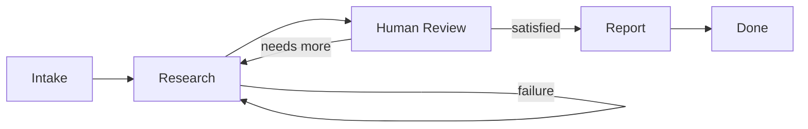

Real business processes aren't linear. A sales outreach might go: research a prospect, draft a message, realize the research is thin, go back and dig deeper, draft again, get human approval, send. There are loops, branches, fallbacks, and decision points.

Hive models this as a directed graph. Nodes do work, edges connect them, and shared memory lets them pass data. The framework walks this structure — running nodes, following edges, managing retries — until the agent reaches its goal or exhausts its step budget.

## Why a graph

Edges can loop back, creating feedback cycles where an agent retries a step or takes a different path. That's intentional. A graph that only moves forward can't self-correct.

```
intake → research → draft → [human review] → send → done
           ↑                                   |
           └──────── on failure ───────────────┘
```

This structure lets agents adapt based on results, not just execute predefined steps.

## Nodes

A node is a unit of work. Each node reads inputs from shared memory, does something, and writes outputs back.

### Event loop nodes

The only node type in Hive is `event_loop`. It's a multi-turn LLM loop where the model reasons about the current state, calls tools, observes results, and keeps going until it has produced the required outputs.

```python examples/templates/deep_research_agent/nodes/__init__.py
from framework.graph import NodeSpec

research_node = NodeSpec(
    id="research",
    name="Research",
    description="Search the web, fetch source content, and compile findings",
    node_type="event_loop",
    input_keys=["research_brief", "feedback"],
    output_keys=["findings", "sources", "gaps"],
    nullable_output_keys=["feedback"],
    success_criteria=(
        "Findings reference at least 3 distinct sources with URLs. "
        "Key claims are substantiated by fetched content, not generated."
    ),
    system_prompt="""
You are a research agent. Given a research brief, find and analyze sources.

Work in phases:
1. **Search**: Use web_search with 3-5 diverse queries.
2. **Fetch**: Use web_scrape on the most promising URLs.
3. **Analyze**: Review what you've collected and identify key findings.

When done, use set_output:
- set_output("findings", "Structured summary with source URLs")
- set_output("sources", [{"url": "...", "title": "..."}])
- set_output("gaps", "What aspects are not well-covered yet")
""",
    tools=["web_search", "web_scrape", "save_data"],
)
```

All agent behavior happens in these nodes. They handle long-running tasks, manage their own context window, and can recover from crashes mid-conversation.

### Node configuration

Event loop nodes are highly configurable:

<Accordion title="Tools">
  Give the node access to specific capabilities: web search, API calls, database queries, file operations, etc.
</Accordion>

<Accordion title="Client-facing">
  Set `client_facing=True` to make the node interact directly with humans. See [Human-in-the-Loop](/concepts/human-in-the-loop).
</Accordion>

<Accordion title="Input/output keys">
  Declare which keys the node reads from shared memory and which it writes. The framework enforces these boundaries.
</Accordion>

<Accordion title="Success criteria">
  Define what "done" looks like for this node. Used by the judge to evaluate output quality.
</Accordion>

<Accordion title="Max visits">
  Limit how many times the graph can visit this node (useful for preventing infinite loops).
</Accordion>

### Self-correction within a node

The most important behavior in an `event_loop` node is the ability to self-correct. After each iteration, the node evaluates its own output: did it produce what was needed? If yes, it's done. If not, it tries again — but this time it sees what went wrong and adjusts.

This is the **reflexion pattern**: try, evaluate, learn from the result, try again. It's cheaper and more effective than starting over.

```python core/framework/graph/event_loop_node.py
class JudgeVerdict:
    """Result of judge evaluation for the event loop."""
    action: Literal["ACCEPT", "RETRY", "ESCALATE"]
    feedback: str = ""
```

Within a single node, the outcomes are:

- **Accept** — Output meets the bar. Move on.
- **Retry** — Not good enough, but recoverable. Try again with feedback.
- **Escalate** — Something is fundamentally broken. Hand off to error handling.

This is self-correction *within a session* — the agent adapting in real time. It's different from [evolution](/concepts/evolution), which improves the agent *across sessions* by rewriting its code between generations.

## Edges

Edges control flow between nodes. Each edge has a condition:

```python core/framework/graph/edge.py
class EdgeCondition(StrEnum):
    """When an edge should be traversed."""
    ALWAYS = "always"            # Always after source completes
    ON_SUCCESS = "on_success"    # Only if source succeeds
    ON_FAILURE = "on_failure"    # Only if source fails
    CONDITIONAL = "conditional"  # Based on expression
    LLM_DECIDE = "llm_decide"    # Let LLM decide based on goal
```

### Basic routing

```python examples/templates/deep_research_agent/agent.py
from framework.graph import EdgeSpec, EdgeCondition

edges = [
    # Success path: intake -> research
    EdgeSpec(
        id="intake-to-research",
        source="intake",
        target="research",
        condition=EdgeCondition.ON_SUCCESS,
    ),
    # Conditional: review -> research (if more research needed)
    EdgeSpec(
        id="review-to-research-feedback",
        source="review",
        target="research",
        condition=EdgeCondition.CONDITIONAL,
        condition_expr="needs_more_research == True",
    ),
    # Conditional: review -> report (if user satisfied)
    EdgeSpec(
        id="review-to-report",
        source="review",
        target="report",
        condition=EdgeCondition.CONDITIONAL,
        condition_expr="needs_more_research == False",
    ),
]
```

### Data plumbing

Edges handle data mapping between nodes — connecting one node's outputs to another node's expected inputs:

```python
EdgeSpec(
    id="calc-to-format",
    source="calculator",
    target="formatter",
    condition=EdgeCondition.ON_SUCCESS,
    input_mapping={"value_to_format": "result"},  # target_key: source_key
)
```

This lets each node have a clean interface without needing to know where its data came from.

### Parallel execution

When a node has multiple outgoing edges, the framework can run those branches in parallel and reconverge when they're all done:

```python
edges = [
    EdgeSpec(id="search-to-linkedin", source="search", target="linkedin_research"),
    EdgeSpec(id="search-to-twitter", source="search", target="twitter_research"),
    EdgeSpec(id="search-to-news", source="search", target="news_research"),
    # All three branches run in parallel, results merge back to shared memory
]
```

This is useful for tasks like researching a prospect from multiple sources simultaneously.

## Shared memory

Shared memory is how nodes communicate. It's a key-value store scoped to a single session.

```python core/framework/graph/node.py
class SharedMemory:
    """Shared memory for passing data between nodes."""
    def get(self, key: str) -> Any: ...
    def set(self, key: str, value: Any) -> None: ...
    def has(self, key: str) -> bool: ...
```

Every node declares which keys it reads and which it writes, and the framework enforces those boundaries — a node can't quietly access data it hasn't declared.

```python
NodeSpec(
    id="research",
    input_keys=["research_brief", "feedback"],  # What it reads
    output_keys=["findings", "sources"],        # What it writes
    nullable_output_keys=["feedback"],          # Optional outputs
)
```

Data flows through the graph in a natural way:

1. Input arrives at the start
2. Each node reads what it needs and writes what it produces
3. Edges map outputs to inputs as data moves between nodes
4. At the end, the full memory state is the execution result

## Graph structure

A complete graph specification includes:

```python core/framework/graph/edge.py
from framework.graph.edge import GraphSpec

graph = GraphSpec(
    id="deep-research-agent-graph",
    goal_id="rigorous-interactive-research",
    version="1.0.0",
    entry_node="intake",                      # Where execution starts
    entry_points={"start": "intake"},         # Named entry points
    terminal_nodes=[],                        # Where execution can end
    pause_nodes=[],                           # HITL checkpoints
    nodes=[intake_node, research_node, ...],  # All nodes
    edges=[edge1, edge2, ...],                # All edges
    default_model="claude-sonnet-4-5",        # LLM model
    max_tokens=8192,                          # Token limit
)
```

## Execution flow

The framework tracks everything as it walks the graph:

```python core/framework/graph/executor.py
@dataclass
class ExecutionResult:
    """Result of executing a graph."""
    success: bool
    output: dict[str, Any]
    error: str | None = None
    steps_executed: int = 0
    total_tokens: int = 0
    total_latency_ms: int = 0
    path: list[str]                          # Node IDs traversed
    paused_at: str | None = None             # Node ID where paused for HITL
    total_retries: int = 0                   # Retry count across all nodes
    nodes_with_failures: list[str]           # Failed but recovered
    execution_quality: str = "clean"         # "clean", "degraded", or "failed"
```

This metadata feeds into the [worker agent runtime](/concepts/worker-agents) for monitoring and into the [evolution](/concepts/evolution) process for improvement.

## The shape of an agent

A typical agent graph looks something like this:



Key patterns:

- **Entry node** where work begins
- **Chain of nodes** that do the real work
- **HITL nodes** at approval gates
- **Failure edges** that loop back for another attempt
- **Terminal nodes** where execution ends

<Warning>
The framework tracks which nodes ran, how many retries each needed, how much the LLM calls cost, and how long each step took. This data is critical for both monitoring and evolution.
</Warning>

## Real-world example

Here's a complete 4-node research agent with feedback loops:

```python examples/templates/deep_research_agent/agent.py
from framework.graph import GraphSpec, EdgeSpec, EdgeCondition

# Nodes: intake, research, review, report (see NodeSpec definitions above)

edges = [
    EdgeSpec(
        id="intake-to-research",
        source="intake",
        target="research",
        condition=EdgeCondition.ON_SUCCESS,
    ),
    EdgeSpec(
        id="research-to-review",
        source="research",
        target="review",
        condition=EdgeCondition.ON_SUCCESS,
    ),
    EdgeSpec(
        id="review-to-research-feedback",
        source="review",
        target="research",
        condition=EdgeCondition.CONDITIONAL,
        condition_expr="needs_more_research == True",
    ),
    EdgeSpec(
        id="review-to-report",
        source="review",
        target="report",
        condition=EdgeCondition.CONDITIONAL,
        condition_expr="needs_more_research == False",
    ),
]

graph = GraphSpec(
    id="deep-research-agent-graph",
    entry_node="intake",
    nodes=[intake_node, research_node, review_node, report_node],
    edges=edges,
)
```

This graph supports multiple user checkpoints, feedback loops for deeper research, and clean separation of concerns across nodes.