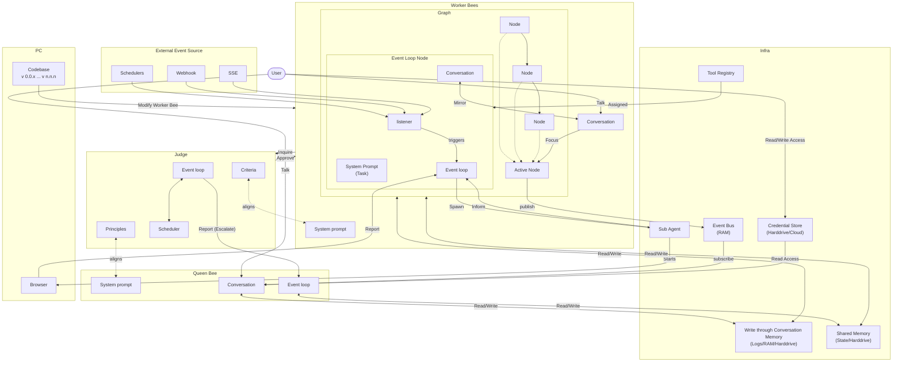

Aden Agent Framework aims to help developers build outcome-oriented, self-adaptive agents. This roadmap outlines our vision and progress across core architecture, tooling ecosystem, memory management, evaluation systems, and deployment infrastructure.

## Architecture Overview

## Core Architecture & Swarm Primitives

### Node-Based Architecture

Implement the core execution engine where every Agent operates as an isolated, asynchronous graph of nodes.

<AccordionGroup>
  <Accordion title="Core Node Implementation" icon="check" defaultOpen>
    - ✅ NodeProtocol with JSON parsing utilities (graph/node.py)
    - ✅ EventLoopNode with LLM conversation management (graph/event_loop_node.py)
    - ✅ Flexible input/output keys with nullable output handling
    - ✅ Node wrapper SDK for agent creation
    - ✅ Tool access layer with MCP integration
  </Accordion>

  <Accordion title="Graph Executor" icon="check">
    - ✅ Graph traversal execution (graph/executor.py)
    - ✅ Node transition management
    - ✅ Error handling and output mapping
    - ✅ ExecutionResult with success/error status
  </Accordion>

  <Accordion title="Shared Memory Access" icon="check">
    - ✅ SharedState manager (runtime/shared_state.py)
    - ✅ Session-based storage (storage/session_store.py)
    - ✅ Isolation levels: ISOLATED, SHARED, SYNCHRONIZED
  </Accordion>

  <Accordion title="Default Monitoring Hooks" icon="circle">
    - ⏳ Performance metrics collection
    - ⏳ Resource usage tracking
    - ⏳ Health check endpoints
  </Accordion>
</AccordionGroup>

### Judge in Event Loop

A separate LLM-powered judge to determine if workers finish their job.

- ✅ **Conversation Judge (Level 2)** - Evaluates node completion against success criteria
- ✅ **Test Evaluation Judge** - Provider-agnostic evaluation
- ⏳ **Multi-Level Judgment Integration** - Automatic retry logic

### Swarm Hierarchy

- ✅ **Judge Bee (Evaluator)** - Evaluation criteria framework with confidence scores
- ✅ **Hive Coder Agent (Builder)** - Forever-alive event loop with tool discovery
- ⏳ **Queen Bee (Orchestrator)** - Multi-agent coordination layer
- ⏳ **Worker Bee (Executor)** - Worker taxonomy and templates

### Coding Agent Workflows

- ✅ **Goal Creation Session** - Goal schema with success criteria and constraints
- ✅ **Agent Creation Flow** - Template reading and dynamic tool binding
- ⏳ **Worker Agent Dynamic Creation** - Runtime worker instantiation

### Security Layer

<CardGroup cols={2}>
  <Card title="Credential Store" icon="check">
    ✅ Multi-backend storage (encrypted file, env vars, HashiCorp Vault)
    
    ✅ Template resolution with caching
    
    ✅ Thread-safe operations
  </Card>
  <Card title="OAuth2 Providers" icon="check">
    ✅ Base provider pattern
    
    ✅ HubSpot integration
    
    ✅ Lifecycle management
  </Card>
  <Card title="Aden Sync Provider" icon="check">
    ✅ OAuth2 token sync from Aden server
    
    ✅ Local fallback support
  </Card>
  <Card title="Enterprise Secret Managers" icon="circle">
    ⏳ AWS Secrets Manager
    
    ⏳ Azure Key Vault
    
    ⏳ Audit logging
  </Card>
</CardGroup>

## Tooling Ecosystem & General Compute

### Sub-agents Parallel Execution

- ✅ **Multi-Graph Sessions** - Load multiple agent graphs in single session
- ✅ **Concurrent Execution Management** - Max concurrent executions config
- ⏳ **Sub-agent Execution Environment** - Isolated runtime with repeatability guarantees

### Browser Use Node

- ✅ **Web Scraping with Playwright** - Headless Chromium with stealth mode
- ✅ **Browser Launch Utilities** - Platform-specific browser opening
- ⏳ **Full Browser Use Node** - Multi-page automation with vision-guided interactions

### Core Graph Framework Infra

- ✅ **Node Validation** - Pydantic-based schema enforcement
- ✅ **Human-in-the-Loop (HITL)** - Pause/approve workflows with HITLRequest protocol
- ✅ **TUI Integration** - Chat REPL with streaming support
- ✅ **Node Lifecycle Management** - Start/stop/pause/resume with state persistence

### Infrastructure Tools

<Tabs>
  <Tab title="Completed" icon="check">
    - ✅ **File Operations** (36+ tools) - read, write, edit, search, diff/patch
    - ✅ **Web Tools** - Search, scraper, Exa, News, SerpAPI
    - ✅ **Data Tools** - CSV, Excel, PDF, Vision, Time
    - ✅ **Communication Tools** (8 tools) - Email, Gmail, Slack, Discord, Telegram
    - ✅ **CRM/API Integrations** (5+ tools) - HubSpot, GitHub, Apollo, BigQuery
    - ✅ **Security/Scanning Tools** (5 tools) - DNS, SSL/TLS, Port Scanner
    - ✅ **Runtime & Logging** - Runtime Log Tool with L1/L2/L3 levels
  </Tab>
  <Tab title="Planned" icon="circle">
    - ⏳ **Audit Trail System** - Decision tracing, compliance reporting
  </Tab>
</Tabs>

## Memory, Storage & File System Capabilities

### Memory Tools

- ✅ **Short-Term Memory (STM)** - SharedState manager for in-memory state
- ✅ **Conversation Memory** - NodeConversation tracks message history
- ⏳ **Long-Term Memory (LTM)** - Semantic indexing and RLM implementation

### Durable Scratchpad

- ✅ **Filesystem as Scratchpad** - File-based persistence layer
- ✅ **Checkpoint System** - Save/restore execution state with TTL cleanup
- ⏳ **Message Model & Session Management** - Per-message file persistence

### Memory Isolation

- ✅ **Session Isolation** - Session-local memory with data bleed prevention
- ✅ **State Management** - SharedState with thread-safe operations
- ⏳ **Context Management** - Message streaming and optimization

## Eval System, DX, & Open Source Guardrails

### Eval System

<AccordionGroup>
  <Accordion title="Completed Features" icon="check" defaultOpen>
    - ✅ Multi-Level Evaluation (Level 0, 1, 2)
    - ✅ Goal-Based Constraints (hard/soft)
    - ✅ Success Criteria Definition with weighted metrics
    - ✅ Test Framework with LLM-based judgment
  </Accordion>
  
  <Accordion title="Planned Features" icon="circle">
    - ⏳ Failure Recording mechanism
    - ⏳ Custom Failure Conditions SDK
  </Accordion>
</AccordionGroup>

### Guardrails SDK

- ✅ **Goal Constraints** - Hard/soft constraint definitions
- ⏳ **Deterministic Guardrails SDK** - In-node guardrail implementation
- ⏳ **Monitoring & Tracking** - Audit logs and compliance reporting

### DevTools CLI

- ✅ **Main CLI** - Run, info, validate, list commands
- ✅ **Testing CLI** - test-run, test-debug, test-list, test-stats
- ✅ **TUI (Terminal UI)** - Interactive chat with streaming
- ⏳ **Memory Management CLI** - Memory inspection and cleanup
- ⏳ **Credential Store CLI** - Interactive credential editing

### Observability

- ✅ **Runtime Logging** - L1/L2/L3 logging levels
- ✅ **Event Bus Monitoring** - Real-time event streaming
- ⏳ **Log Analysis Tools** - User-driven log analysis
- ⏳ **Token Tracking** - Reasoning and cache token tracking

## Deployment, CI/CD & Community Templates

### Self-Deployment

- ✅ **Docker Support** - Python 3.11-slim with Playwright
- ✅ **Agent Runtime** - Multiple entry points (webhook, timer, event, API)
- ✅ **Async Entry Points** - Timer, webhook, and event triggers
- ⏳ **Headless Backend Enhancements** - Standardized APIs

### Lifecycle APIs

- ✅ **Webhook Server** - FastAPI-based webhook server
- ✅ **Graph Lifecycle Management** - Load/unload/start/restart
- ⏳ **REST API Endpoints** - Start, stop, pause, resume endpoints
- ⏳ **WebSocket API** - Real-time event streaming to clients

### CI/CD Pipelines

- ✅ **Test Execution** - Test framework with pytest integration
- ⏳ **Automated Testing Pipeline** - CI integration with GitHub Actions
- ⏳ **Version Control** - Agent versioning system
- ⏳ **Deployment Automation** - CD pipeline with rollback

### Distribution

- ⏳ **Package Distribution** - Official PyPI package and Docker Hub image
- ⏳ **Community Channels** - Discord setup and contribution guidelines
- ⏳ **Cloud Deployment** - AWS Lambda, GCP, Azure Functions support

### Example Agents

- ✅ **Hive Coder Agent** - Agent builder template
- ⏳ **Sales & Marketing Agents** - GTM, lead generation, campaigns
- ⏳ **Analytics & Insights Agents** - Data analysis, reporting
- ⏳ **Training & Education Agents** - Onboarding, content creation
- ⏳ **Automation & Forms Agents** - Smart entry, workflow automation

## Open Hive

### Local API Gateway

- ✅ **MCP Server Foundation** - FastMCP server on port 4001
- ✅ **Event Bus Architecture** - Real-time streaming with graph-scoped routing
- ⏳ **Local API Gateway** - Lightweight server for browser access
- ⏳ **Memory Layer API** - Memory read/write endpoints

### Visual Graph Explorer

- ⏳ **Graph Visualization** - React Flow integration
- ⏳ **Interactive Features** - Drag-and-drop canvas
- ⏳ **Integration with Runtime** - Live execution visualization

### TUI to GUI Upgrade

- ✅ **TUI Foundation** - Terminal chat with streaming
- ⏳ **Web Application** - Modern web UI framework
- ⏳ **Chat Interface** - Browser-based chat UI
- ⏳ **TUI Feature Parity** - All commands in GUI

### Memory & State Inspector

- ✅ **Runtime Logs Tool** - Inspect agent session logs
- ⏳ **Memory Inspector UI** - Shared memory visualization
- ⏳ **Node State Inspection** - Click-to-inspect functionality
- ⏳ **Debug Tools** - Memory diff viewer

### Local Control Panel

- ✅ **Credential Management Backend** - CredentialStore with multiple backends
- ⏳ **Credential Management Dashboard** - Web UI for credential editing
- ⏳ **Swarm Lifecycle Management** - Start/stop controls in browser
- ⏳ **Monitoring Dashboard** - Active agents and resource usage

### Local Model Integration

- ✅ **LLM Integration Layer** - Provider-agnostic via LiteLLM
- ⏳ **Local Model Support** - Ollama integration and configuration
- ⏳ **Offline Mode** - Full offline functionality
- ⏳ **Model Configuration** - Easy model switching in UI

### Cross-Platform Support

- ⏳ **JavaScript/TypeScript SDK** - npm package distribution
- ⏳ **Platform Compatibility** - Windows, macOS, Linux optimization

### Coding Agent Integration

- ⏳ **IDE Integrations** - Claude Code, Cursor, Opencode, Antigravity, Codex CLI

## Legend

- ✅ **Completed** - Feature is implemented and shipped
- ⏳ **Planned** - Feature is on the roadmap

## Contributing

We welcome contributions! If you'd like to help build any of these features, check out our [contributing guide](/resources/contributing) or join our [Discord community](https://discord.com/invite/MXE49hrKDk).